<p align="center">
  
</p>

<h1 align="center">Obscura</h1>

<p align="center">
  <strong>A modern, self-hosted private media browser.</strong>
  <br />
  Video-first. First-class images, galleries, and audio. Designed for a single trusted user on a private LAN.
</p>

<p align="center">
  <a href="#quick-start">Quick Start</a> &middot;
  <a href="#highlights">Highlights</a> &middot;
  <a href="#features">Features</a> &middot;
  <a href="#configuration">Configuration</a> &middot;
  <a href="#development">Development</a>
</p>

<p align="center">
  
</p>

---

## What is Obscura?

Obscura is a **modern alternative for anyone who wants a Stash-style private media library** with a focus on usability, polish, and quality-of-life. Stash is a great project with a deep ecosystem — Obscura keeps the core idea (a self-hosted, metadata-rich library with community scrapers) and rebuilds the experience around a refined mobile-first UI, a streamlined scanning pipeline, and a single Docker image with zero configuration.

If you like the Stash model but want a faster, cleaner interface that feels native on phones and desktops alike, Obscura is built for you.

---

## Highlights

- **Video, images, galleries, and audio** — all first-class library entities, not afterthoughts.
- **SFW / NSFW split personality** — swap the entire library between safe-for-work and full modes with a global keyboard shortcut on desktop or a hidden gesture on mobile.
- **Mobile first** — built for phones from day one. The desktop view is an expansion of the mobile design, not the other way around.
- **Stash-compatible metadata** — native StashDB support and full compatibility with community Stash scraper plugins.
- **Bulk scrape everything** — pick what to identify and Obscura iterates every installed scraper for you. No more one-by-one.
- **Rich playback** — HLS adaptive streaming with on-demand ffmpeg transcoding, a scrollable/grabable frame strip, and one-click marker + thumbnail creation from any frame.
- **Subtitles & live transcripts** — multi-language sidecar / embedded / uploaded tracks, three player caption styles, a clickable transcript panel that can dock next to the video on desktop.
- **Link everything together** — scenes, galleries, audio, performers, and studios all cross-reference with the same rich metadata surface.
- **Automated scanning** — point it at a folder, walk away. Obscura scans on a schedule and notices new files.
- **Command palette + global search** — `⌘K` from anywhere, or a dedicated search page with scene, performer, studio, tag, and gallery results.
- **Drag-and-drop uploads** — add files from the browser, remove from the library, or remove from disk entirely.
- **One image, one port** — everything runs in a single Docker container. No external Postgres, no Redis URLs, no env wrangling.

---

## Quick Start

Obscura ships as a **single Docker image** with PostgreSQL, nginx, ffmpeg, and all three services bundled. No external databases. No configuration required.

### Docker Run

```bash
docker run -d \
  --name obscura \
  -p 8008:8008 \
  -v obscura-data:/data \
  -v /path/to/your/media:/media \
  ghcr.io/pauljoda/obscura:latest
```

### Docker Compose

```yaml
services:
  obscura:
    image: ghcr.io/pauljoda/obscura:latest
    ports:
      - "8008:8008"
    volumes:
      - obscura-data:/data
      - /path/to/your/media:/media
    restart: unless-stopped

volumes:
  obscura-data:
```

```bash
docker compose up -d
```

Open **http://localhost:8008** and you're done.

### Volumes

| Mount | Purpose |
|-------|---------|
| `/data` | Database, cache, thumbnails, trickplay sprites, HLS transcodes |
| `/media` | Your media library. Mount one or more directories here |

You can map as many subdirectories under `/media` as you like and register each one as a library root in Settings.

### Image tags

Obscura publishes two channels to `ghcr.io/pauljoda/obscura`:

| Tag | What it is | When to use |
|-----|------------|-------------|
| `latest` | The most recent tagged release (`vX.Y.Z`) | Default for end users. Stable, versioned, paired with a GitHub Release and changelog entry |
| `X.Y.Z` / `X.Y` / `X` | A specific released version (or minor / major line) | Pin to a known version for reproducible deploys |
| `dev` | Every commit on `main` after CI passes | Bleeding edge. Expect churn. Good for testing fixes before a release |
| `sha-abc1234` | A specific commit SHA on `main` | Pin to an exact dev build for rollback or bisection |
| `X.Y.Z-abc1234` | A specific commit against the in-progress `X.Y.Z-dev` cycle | Same as `sha-…` but self-describing — shows which release this dev build is headed toward |

If you're running Obscura as your media browser and want things to Just Work, use `:latest`. If you want to try a change that hasn't shipped yet, use `:dev`. See [CHANGELOG.md](CHANGELOG.md) for everything that's gone into each release, and the [GitHub Releases page](https://github.com/pauljoda/obscura/releases) for the same notes rendered with assets.

---

## Features

### Library Dashboard

An at-a-glance overview of your collection: totals, recent activity, queue state, and live job status.

<p align="center">
  
</p>

### Videos

A responsive grid of scene cards with thumbnails, duration, resolution badges, and quick metadata. Filter, sort, and view as cards or a compact list.

<p align="center">
  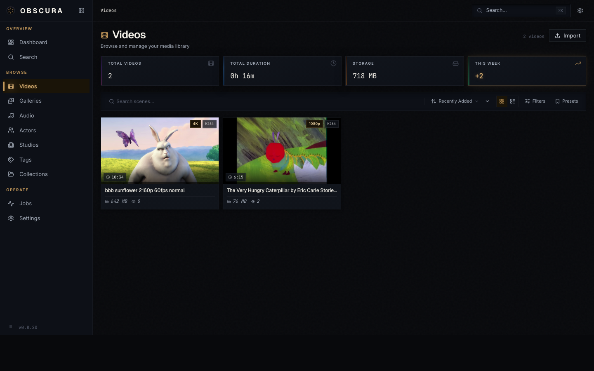
</p>

### Folder Browse & Detail

The video library supports two browsing modes. **Grid/List** shows every scene in your library as a flat feed you can sort, filter, and search. **Folders** mirrors the directory structure on disk, letting you navigate into subfolders, see scene counts per folder, and drill down to scenes inside a specific directory.

<p align="center">
  
</p>

Clicking into a folder opens a detail view inspired by media servers like Jellyfin. Each folder can carry its own metadata: a poster and backdrop image, description, studio, date, star rating, linked performers (shown as a scrollable Cast & Crew strip), and tags. The edit panel uses the same chip pickers and autocomplete as scene editing, so adding performers, tags, and studios is fast. Uploading or dragging files while viewing a folder places them directly into that folder's directory on disk — no library root picker needed.

Folders are also searchable from the command palette and the full search page, and appear on studio and tag detail pages when associated.

### Rich Video Playback

Direct playback of common formats plus on-demand HLS transcoding for anything the browser won't play natively. The scrollable frame strip under the player lets you scrub by thumbnail — and turn any frame into a marker or a custom preview image with a single click.

<p align="center">
  
</p>

### Subtitles & Live Transcripts

Obscura treats subtitles as a first-class feature. Three ingestion paths are wired up end-to-end:

- **Sidecar discovery** — drop a `.srt` / `.vtt` / `.ass` next to a video (optionally tagged with a language, e.g. `movie.en.srt`) and it gets picked up on the next library scan.
- **Embedded extraction** — a background worker job runs `ffmpeg` against videos with soft-subtitle streams and converts each track to WebVTT automatically. Image-based subtitle codecs (PGS, VobSub) are skipped gracefully.
- **Manual upload** — drop a file in from the scene page with an inline language picker.

All tracks land in a shared **Transcript** tab where you can rename them inline, delete them, or trigger a re-extract. The transcript itself shows the full cue list with the current line highlighted, past lines grayed but still clickable, and a single click on any cue seeks the player.

<p align="center">
  
</p>

On desktop, a **Dock next to video** button pins the transcript directly beside the player with a draggable resize handle between them — watch and read at the same time, no context switching. The dock preference and last-used width persist in `localStorage`, follow you across scenes, and auto-collapse on scenes without subtitles so you never see empty space.

<p align="center">
  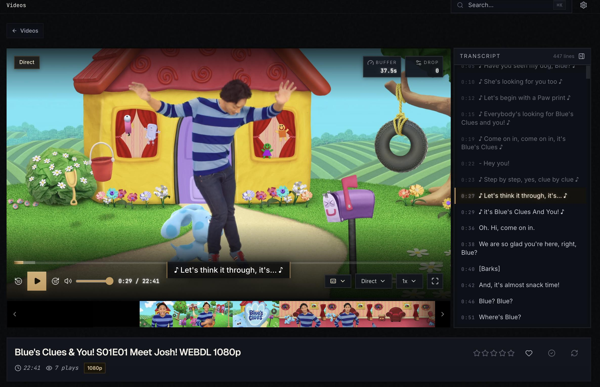
</p>

The player renders captions through a custom overlay with three visual styles you can switch between on the fly:

- **Stylized** — Dark Room brass-edged plate with a subtle glow, matches the rest of the UI.
- **Classic** — flat translucent-black box with plain white text, the look of most media players.
- **Outline** — white text with a black stroke and no box, maximum transparency over the picture.

Text size and vertical position are continuously adjustable, and an in-player settings side panel lets you tweak everything live on top of whatever is currently playing. Per-user overrides persist locally; a reset button snaps you back to the library defaults.

<p align="center">
  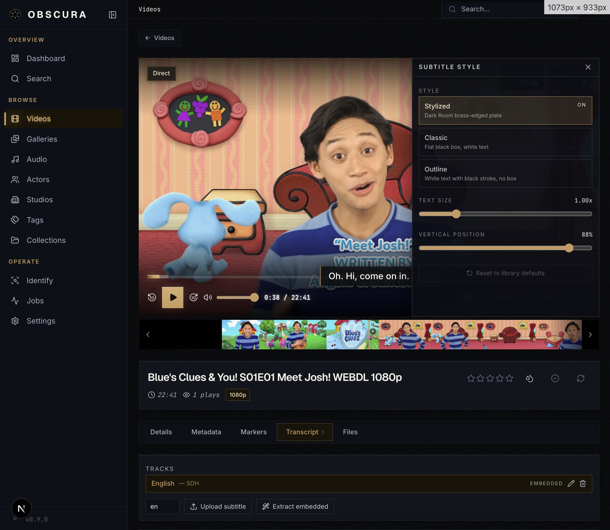
</p>

Library-wide defaults — auto-enable on load, preferred-language priority list (first match wins, with ISO 639-1 ↔ 639-2 equivalence so `en` also matches `eng`), default caption style, text size, and position — are all configurable from the global settings page, with a live dummy-frame preview that updates as you tweak the controls.

<p align="center">
  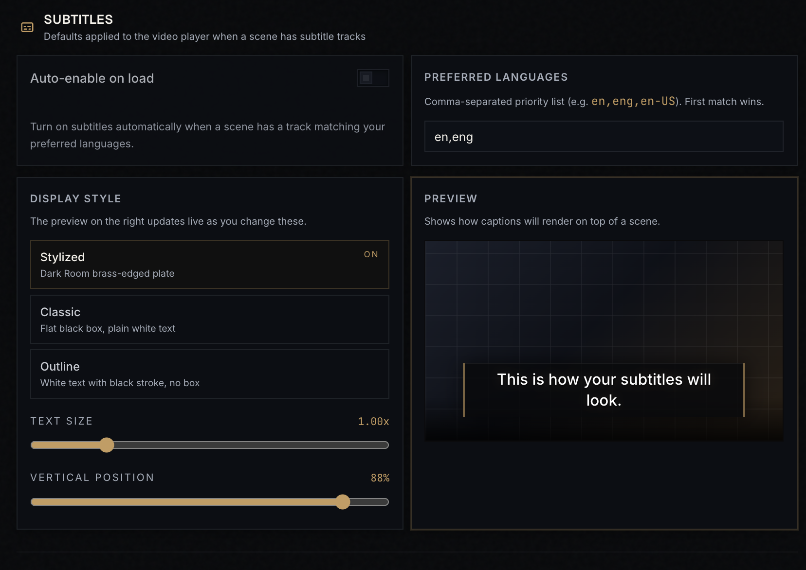
</p>

### Strong Metadata, Everywhere

Every entity carries the same rich metadata surface — title, studio, performers, tags, ratings, custom notes, and provenance. StashDB and community Stash scrapers are supported natively, so migrating is painless.

<p align="center">
  
  
</p>

### Bulk Scraping

Select a batch of unmatched scenes, galleries, or performers and Obscura will iterate every installed scraper to find a match. No more identifying things one at a time.

<p align="center">
  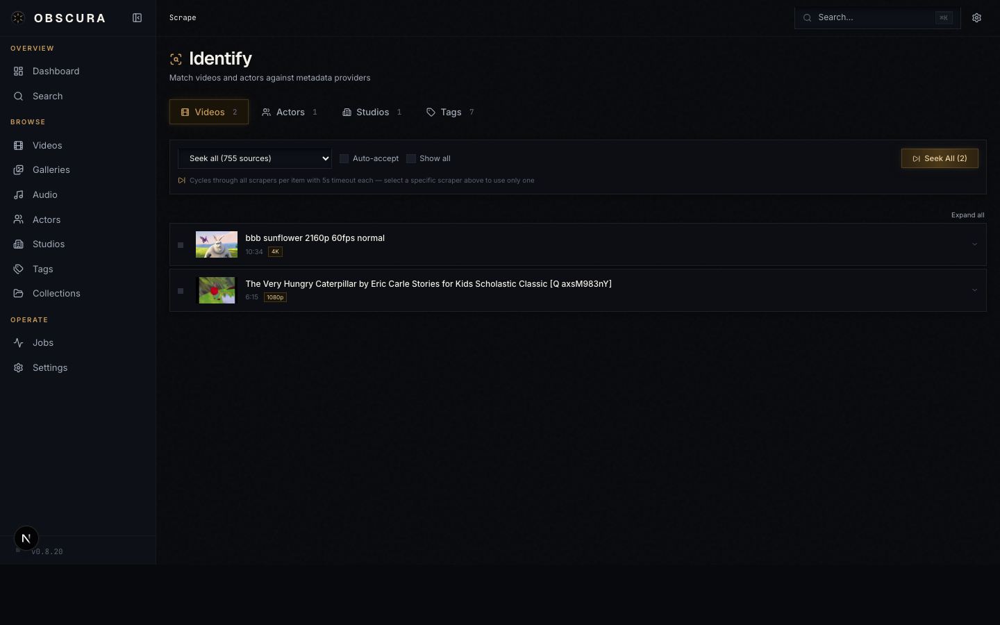
</p>

### Community Scrapers

Browse, install, enable, and disable community Stash scrapers directly from the UI. The full public index is built in — no manual file copying.

<p align="center">
  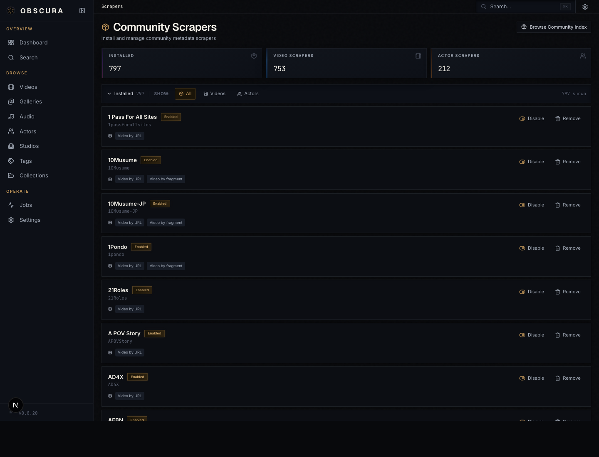
</p>

### Image Galleries

Folder-based and archive-based galleries are first-class. Browse, tag, rate, link performers and studios, and view them in grid or lightbox modes.

<p align="center">
  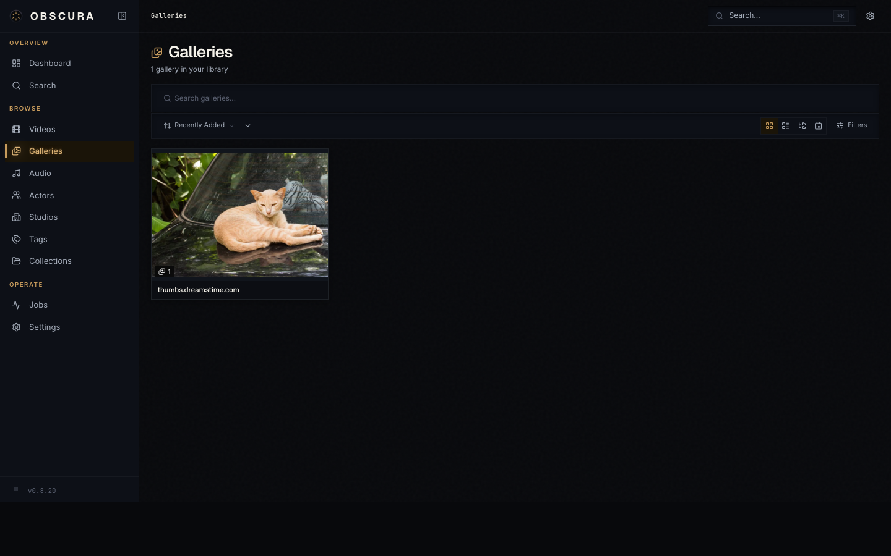
</p>

### Audio Libraries

Organize and play your audio collection with the same metadata pipeline — libraries, tracks, cover art, tags, and performer/studio linking. Includes a built-in player with shuffle and playlist support.

<p align="center">
  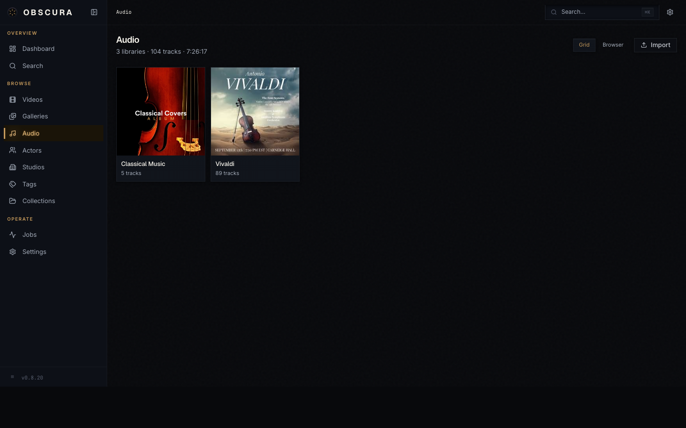
  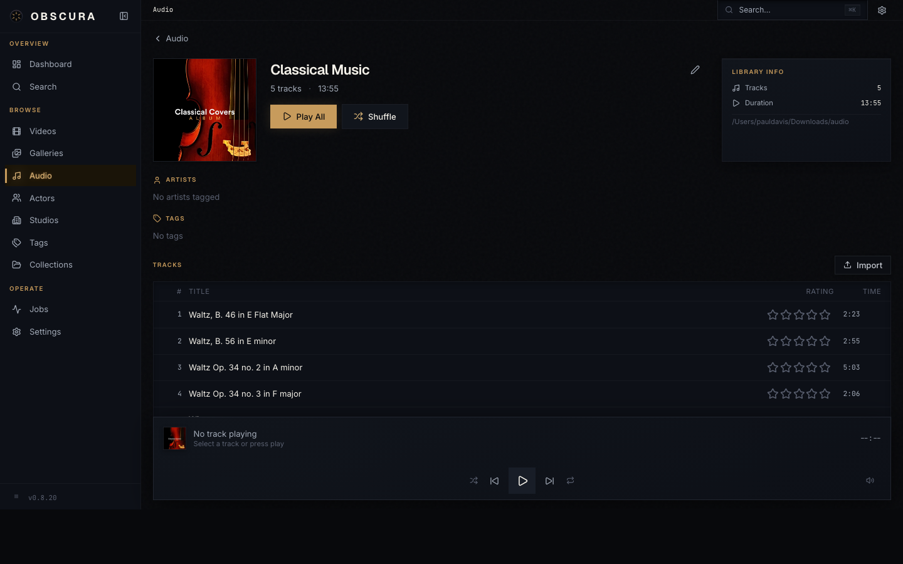
</p>

### Global Search + Command Palette

Press `⌘K` (or `Ctrl+K`) from anywhere to jump to anything. There's also a dedicated search page that spans scenes, performers, studios, galleries, tags, and audio libraries.

<p align="center">
  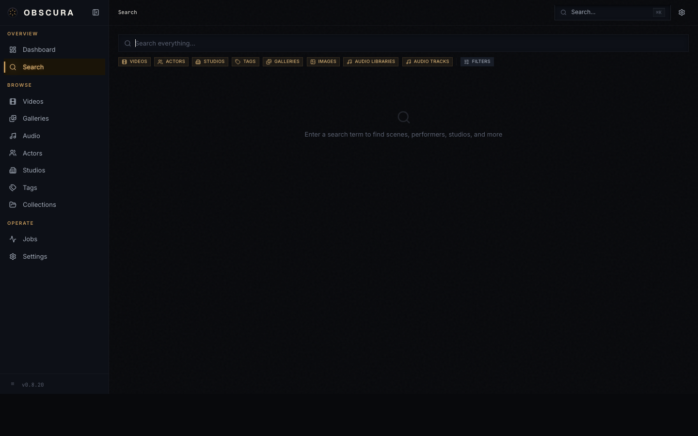
</p>

### Library Scanning + Settings

Register multiple library roots, choose whether generated assets (trickplays, sprites, previews, HLS cache) live next to your media files or in a dedicated cache volume, and enable automatic periodic scanning so new files show up on their own.

<p align="center">
  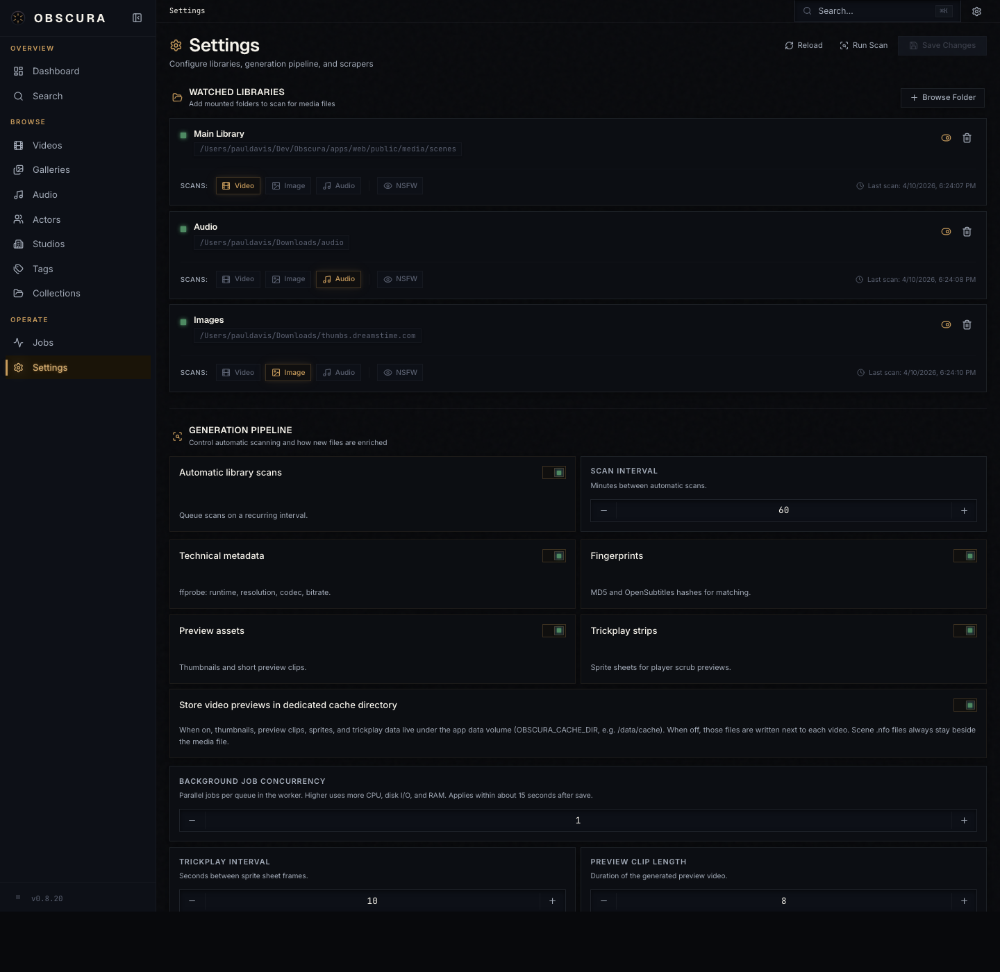
</p>

### Job Control

A live view of every queue and job — library scan, probe, fingerprint, thumbnail, sprite, HLS, import, scrape. Retry, cancel, and watch progress in real time.

<p align="center">
  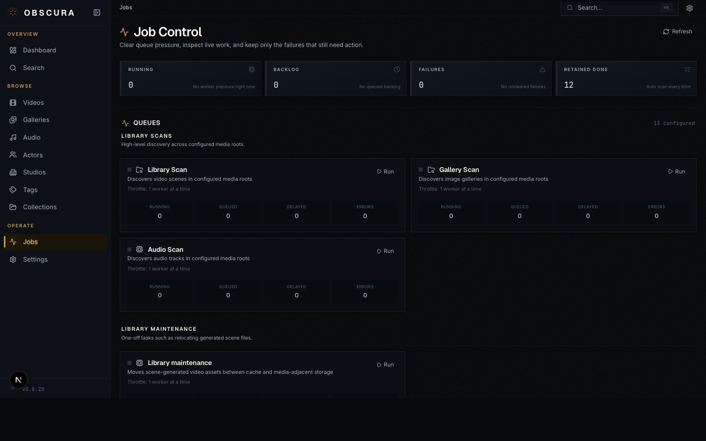
</p>

### SFW / NSFW Mode

Flip the entire library between safe-for-work and full modes with a global keyboard shortcut on desktop, or a hidden gesture on mobile. Per-root NSFW flags propagate to all scenes, images, galleries, audio libraries, and tracks under that path.

### First-Class Mobile

Every view is designed for a phone first. Navigation, playback, scanning, scraping — everything works on mobile, not just "sort of."

<p align="center">
  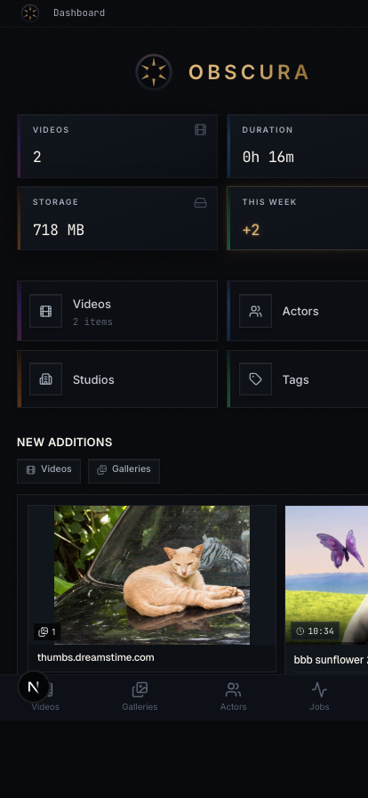
  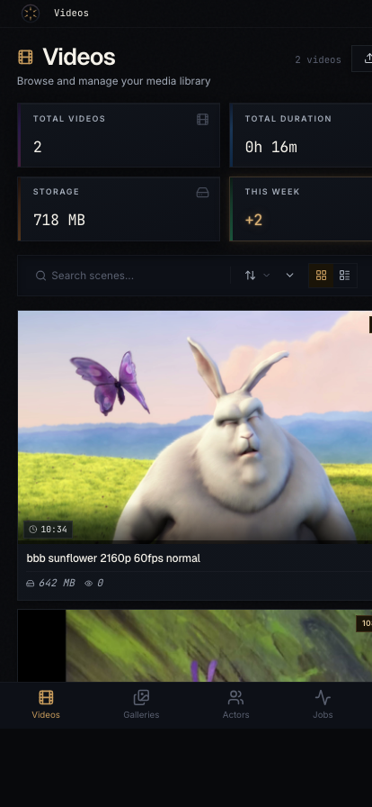
  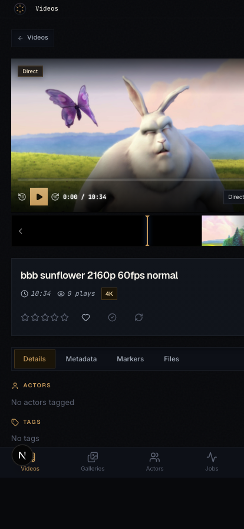
  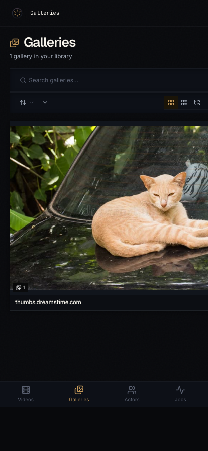
</p>

### Uploads & Removal

Drag files directly into the browser, or use the upload picker. Remove items from the library, or remove them from disk entirely — your choice, per action.

---

## Configuration

Obscura works out of the box with zero configuration. These environment variables are available for advanced use:

| Variable | Default | Description |
|----------|---------|-------------|
| `OBSCURA_CACHE_DIR` | `/data/cache` | Directory for HLS cache, thumbnails, sprites, previews |
| `OBSCURA_MAX_VIDEO_UPLOAD` | `21474836480` | Max bytes for a single upload (default ~21 GiB) |

### Multiple Media Directories

Mount as many media directories as you need:

```bash
docker run -d \
  --name obscura \
  -p 8008:8008 \
  -v obscura-data:/data \
  -v /mnt/nas/videos:/media/videos \
  -v /mnt/nas/photos:/media/photos \
  -v /mnt/nas/music:/media/music \
  ghcr.io/pauljoda/obscura:latest
```

Then add each one as a library root in **Settings → Library**. Per-root, you can choose whether generated assets live alongside the media files or in Obscura's dedicated cache directory.

---

## Design Language

Obscura uses a **Dark Control Room** visual system inspired by Blackmagic DaVinci Resolve, high-end audio rack gear, and film color-grading suites.

- **Surface hierarchy** — Five levels from near-black graphite to elevated panel gray
- **Accent** — Burnished brass (`#c49a5a`), used sparingly for active and selected states, always with glow
- **Typography** — Geist (headings), Inter (body), JetBrains Mono (metadata and utility)
- **Motion** — Weighted and deliberate, precision machinery, no bounce
- **Shape** — Sharp corners everywhere (`border-radius: 0`)

Full specification in [`docs/design-language.md`](docs/design-language.md).

---

## What's Inside

The single image bundles:

| Component | Role |
|-----------|------|
| **Next.js 15** | Web frontend (React 19, Tailwind CSS 4) |
| **Fastify 5** | HTTP API (Drizzle ORM) |
| **pg-boss** | Background job queue (Postgres-backed, no Redis) |
| **PostgreSQL 16** | Database |
| **ffmpeg** | Video and audio transcoding |
| **nginx** | Reverse proxy on port 8008 |

All services run inside the container, coordinated by a single entrypoint. Port **8008** is the only exposed port.

---

## Development

### Prerequisites

- Node.js 22+
- pnpm 10+
- Docker and Docker Compose (for PostgreSQL)

### Setup

```bash
git clone https://github.com/pauljoda/obscura.git
cd obscura

pnpm install

# Start PostgreSQL (pg-boss manages the queue inside the DB)
docker compose -f infra/docker/docker-compose.yml up postgres -d

# Push schema
pnpm --filter @obscura/api db:push

# Start all services in dev mode
pnpm dev
```

The web UI runs at `http://localhost:8008` and the API at `http://localhost:4000`.

### Commands

| Command | Description |
|---------|-------------|
| `pnpm dev` | Start all services in development |
| `pnpm build` | Build all apps and packages |
| `pnpm check` | Lint and typecheck across the monorepo |
| `pnpm release:check` | Validate version and changelog alignment |
| `pnpm --filter @obscura/api db:push` | Push schema changes to PostgreSQL |
| `pnpm --filter @obscura/api db:studio` | Open Drizzle Studio |

### Building the Docker Image Locally

```bash
# Dev-style build (does not require a matching CHANGELOG release heading)
docker build -f infra/docker/unified.Dockerfile -t obscura .

# Release-style build (enforces package.json version matches a released
# CHANGELOG heading — fails on -dev versions). Used by the Release workflow.
docker build -f infra/docker/unified.Dockerfile --build-arg RELEASE_STRICT=1 -t obscura .

docker run -p 8008:8008 -v obscura-data:/data -v /your/media:/media obscura
```

### Releases

Obscura follows [Semantic Versioning](https://semver.org/) and [Keep a Changelog](https://keepachangelog.com/).

- Every commit to `main` rebuilds the `:dev` image and appends entries to `## [Unreleased]` in `CHANGELOG.md`. Each unreleased section leads with a **What's New** TL;DR of the most impactful user-facing changes, followed by detailed entries grouped by Added / Changed / Fixed. The root `package.json` carries a `X.Y.Z-dev` marker between releases.
- Releases are cut server-side by the **Release** GitHub Action. Maintainers trigger it from the Actions tab with a `patch` / `minor` / `major` bump (or an explicit `X.Y.Z`). The workflow:
  1. Runs `scripts/release/cut.mjs --phase release`: bumps every `package.json`, promotes `## [Unreleased]` to `## [X.Y.Z] - YYYY-MM-DD`, and writes `RELEASE_NOTES.md` from the new section.
  2. Creates commit `chore(release): vX.Y.Z` and tag `vX.Y.Z`.
  3. Runs `scripts/release/cut.mjs --phase post`: bumps to `X.Y.(Z+1)-dev` and commits `chore(release): begin vX.Y.(Z+1)-dev cycle`.
  4. Pushes main + tag.
  5. Builds the unified Docker image with `RELEASE_STRICT=1` from the release tag and pushes `latest`, `X.Y.Z`, `X.Y`, and `X` to GHCR.
  6. Creates a GitHub Release for `vX.Y.Z` with the extracted changelog as the body.
- Users consuming `:latest` always get the most recent released build — never a half-finished `main`. Users who want to test unreleased changes can pin `:dev` or a specific `:sha-…` tag.

See the release runbook and full policy in [CLAUDE.md](CLAUDE.md#how-to-publish-a-release).

---

## License

Licensed under [CC BY-NC-SA 4.0](https://creativecommons.org/licenses/by-nc-sa/4.0/).

You are free to share and adapt this work for non-commercial purposes, with attribution, under the same license terms. See [LICENSE](LICENSE) for details.
